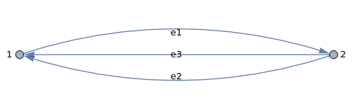
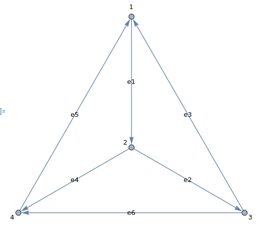
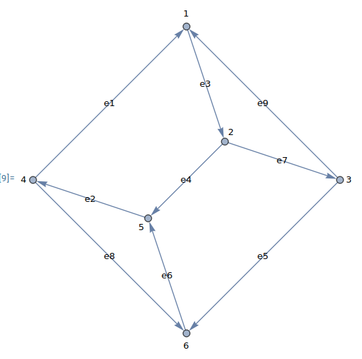

# Integrand Evaluation Examples

Examples demonstrating the evaluation of loop integrands at finite temperature and chemical potential

## Installation

Install dependencies:
```bash
pip install -r requirements.txt
```

## Usage

Run the example:
```bash
python example_symbolica_integrand.py
```
or the stable stack example using multiple precision levels for stable evaluation:
```bash
python example_stable_stack.py
```

## Project Structure

- `examples/` - Configuration files and integrand definitions
- `integrands/` - Integrand implementations
  - `integrand.py` - Abstract class for integrands
  - `symbolica_integrand.py` - Symbolica implementation of integrands with double precision
  - `symbolica_integrand_prec.py` - Symbolica implementation of integrands with arbitrary precision
  - `stable_stack.py` - Stack of integrands with different precision levels for stable evaluation
- `samplers/` - Sampler implementations
  - `sampler.py` - Abstract class for samplers (we only need the SamplerResult class)

## Examples

The $n$-loop integrands do not include the normalization factor $1/(2\pi)^{3n}$ but the reported integrated results do include it. Also, integrated counterterms are not included so the results depend on $m_\text{UV}$.

### Two-loop QCD sunset



- Loop-momentum-basis edges: the two fermionic edges `e1` and `e2`
- Targets for specific parameter choices:

| $(m_\text{UV}, \mu, \beta)$ | Target               |
| --------------------------- | ---------------------|
| $(2\pi T, \pi T, 1/T)$      | $0.0138889\cdot T^4$ |
| $(2\pi T, 0, 1/T)$          | $0.0373264\cdot T^4$ |

### Three-loop QCD Mercedes



- Loop-momentum-basis edges: the three fermionic edges `e1`, `e2` and `e3`
- Targets for specific parameter choices:

| $(m_\text{UV}, \mu, \beta)$ | Target               |
| --------------------------- | ---------------------|
| $(2\pi T, \pi T, 1/T)$      | $0.0290399\cdot T^4$ |
| $(2\pi T, 0, 1/T)$          | $0.0714390\cdot T^4$ |

### Four-loop Bugblatter in PQ-QCD



- Loop-momentum-basis edges: the two fermionic and two bosonic edges `e1`, `e2`, `e3` and `e4`
- Targets for specific parameter choices: **unknown**